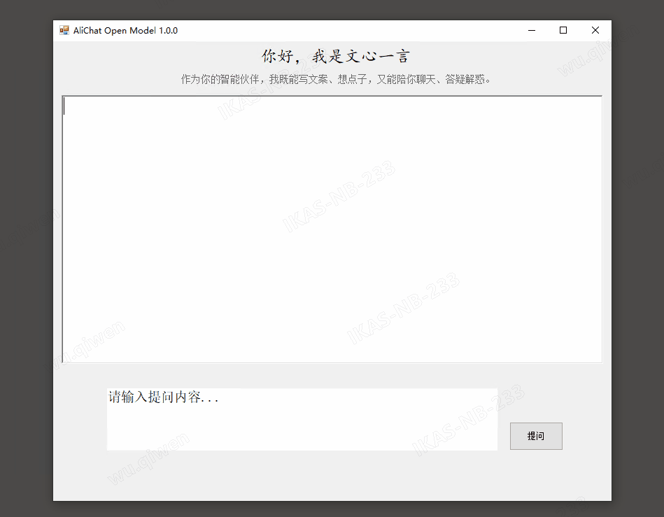

# AliOpenModelWinFormChat
基于C#开发的大模型对话窗体应用，阿里免费大模型接口调用





# 本项目技术栈为： 
- C#
- .NET 4.81


# 运行前准备
- 1、获取API-KEY
```
访问和注册阿里云百炼
https://bailian.console.aliyun.com/?apiKey=1#/api-key- 
```
- 2、配置API-KET
```
在项目路径AliChat/AliAPI中配置你自己的api-key
```
- 3、进入模型广场搜索开源模型
```
https://bailian.console.aliyun.com/#/model-market
```


# 声明
- 本项目仅用作学习用途
- 本项目不会上传任何你的数据至任何第三方系统
- 如果发生任何回传行为，请检查是否为第三方修改版本
